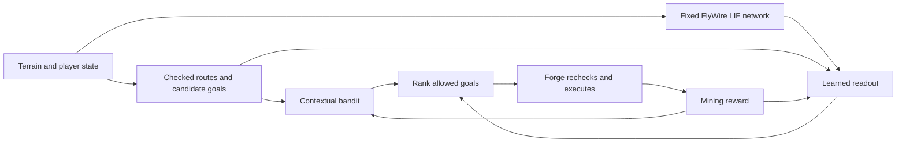

<div align="center">

# ⛏️ FlyMiner

### Tiny wings. Big mining plans. Please pack a lunch.


A Minecraft mining companion with a Rust controller, a Forge client bridge,
and an experimental fruit-fly brain in its backpack. 🪰

[Get started](#-spawn-in) · [Commands](#-the-command-chest) · [Learning](#-a-fly-brain-and-a-bandit) · [Research notes](docs/fly-brain-rust.md)

</div>

Pick an ore, mark your home chest, and let FlyMiner follow the vein. It can dig
staircases, eat, place torches, craft replacement pickaxes, and bring its haul
home before heading back to your mine.

**This is an experimental automation project.** The planner controls which
actions are allowed; the fly-inspired network helps rank mining choices. We have
not demonstrated that it out-mines a simpler model. Use it in worlds and on
servers where this kind of automation is welcome.

## 🎒 What's in the backpack?

| Ability | What it does |
| --- | --- |
| **Ore wishlist** | Choose a registered ore with Tab completion; matching vanilla deepslate variants count together. |
| **One vein at a time** | Commit to a connected target vein, including diagonal neighbors, until cleared or blocked. |
| **Staircase explorer** | Prefer a checked descent when no target is reachable; use level detours when needed. |
| **Mind the lava** | Require a two-block fluid buffer, supported ground, and known terrain before moving or digging. |
| **Snack breaks** | Eat when hungry, wait for health recovery, and pause when supplies or conditions prevent progress. |
| **Personal space** | Switch to a sword for nearby visible enemies, then resume mining when clear. |
| **Cozy tunnels** | Place ordinary torches at checked nearby spots when the area is dark. |
| **Tool bench** | Craft diamond → iron → stone pickaxes from supplies; prepare a table/furnace and smelt iron when possible. No wooden picks. |
| **Home sweet home** | Return, find reachable chests, deposit cargo, refill supplies, then resume at the saved mine point. |
| **A little memory** | Save learned scores and terrain separately for each world/server, player, dimension, and target. |

## 🌱 Spawn in

You need **Minecraft Java 1.20.1 + Forge 47.4.20**, **JDK 17**, and Rust/Cargo.
Development and live testing use Windows and SteamPunk [LPS]. Singleplayer and
multiplayer use the same commands. Other modpacks and operating systems have
not been live-validated.

### 1. Grab the project

```powershell
git clone https://github.com/Rayato159/minecraft-auto-mining.git
cd minecraft-auto-mining
Copy-Item .env.example .env
```

Edit `.env` to point at the instance containing your `mods` folder:

```dotenv
MC_INSTANCE='C:\path\to\your\minecraft-instance'
```

Minecraft signs in through your normal launcher. FlyMiner does not need your
Microsoft password or an access token.

### 2. Build and install the bridge

```powershell
.\build-bridge.ps1 -JdkPath 'C:\path\to\jdk-17'
```

Omit `-JdkPath` if `JAVA_HOME` points at JDK 17. The first build downloads
dependencies; later builds can use `-Offline` when cached.

**Close the Minecraft instance**, then install:

```powershell
.\install-bridge.ps1
```

The installer reads `.env`, backs up previous FlyMiner jars locally, verifies
hashes, and installs `flyminer-0.7.1.jar`. Alternatively, copy that jar from
`forge-bridge/build/libs/` into `mods/`; keep only one FlyMiner jar.
This is a client mod. The server does not need the bridge installed.

### 3. Choose your brain

Fetch the pinned v783 dataset once (about 104 MB). Downloads are SHA-256 checked
and stay outside Git:

```powershell
.\fetch-brain.ps1
cargo build --release --locked
```

To start with the lightweight baseline, skip the download and run with
`--no-brain`. Planning, survival, crafting, and storage still work.

### 4. Pack lunch and set your waypoints

Launch Minecraft and carry a suitable pickaxe, sword, food, and torches.
Keep wood, sticks, coal, and stone-tool materials for replacements.
Stand near your home chest:

```text
/flyminer home set
/flyminer home radius 16
/flyminer home search 8
```

Stand at the spot where mining should resume:

```text
/flyminer mine set
/flyminer target minecraft:iron_ore
/flyminer enable
```

Close chat and menus. Start the controller **from the project root**:

```powershell
cargo run --release -- run
```

Or, without the fly network:

```powershell
cargo run --release -- run --no-brain
```

Enabling grants control for the current world/server, player, and dimension.
Leaving that session or dying disables it. Opening a menu interrupts actions.
Stop whenever you want with **Ctrl+C** or **`/flyminer stop`**.

## 📜 The command chest

| In game | Purpose |
| --- | --- |
| `/flyminer enable` | Allow local control in this session. |
| `/flyminer stop` | Stop actions and disable control. |
| `/flyminer status` | Show bridge status. |
| `/flyminer target <ore-id>` | Prioritize an ore; press **Tab** for suggestions. |
| `/flyminer target clear` | Restore normal ore priorities. |
| `/flyminer home set [X Y Z]` | Set the chest area; omit coordinates to use your position. |
| `/flyminer home radius <blocks>` | Protect a horizontal radius from digging **at every height**. |
| `/flyminer home search <blocks>` | Set chest search radius, from 1 to 16. |
| `/flyminer home` | Request a return, deposit/refill, then resume mining. |
| `/flyminer home status` | Show this world's home settings. |
| `/flyminer home clear` | Remove the waypoint and its protection. |
| `/flyminer mine set [X Y Z]` | Set the standing point to return to after storage. |

The controller must be running to act on a home request. Leave a connected
entrance or staircase: FlyMiner won't dig through the protected cylinder beneath
your house. Without a usable pickaxe, only existing passages can be used.

Unloading keeps tools, food, torches, and reserves of logs, planks, sticks,
coal/charcoal, and stone-tool materials. Routine crafting groups keep about a
stack each; whole-stack transfers can leave slightly more than 64. A full chest
triggers a search for another reachable chest. Missing space or supplies causes a pause.

```powershell
cargo run --release -- status
cargo run --release -- scan
cargo run --release -- craft
cargo run --release -- stop
cargo run --release -- run --max-actions 12 --max-seconds 60
```

`scan` previews a plan without moving or mining. `craft` attempts a replacement
pickaxe without starting a mining run. `--instance 'C:\path\to\instance'`
overrides `.env`; action limits include scans and equipment changes.

## 🪰 A fly brain… and a bandit?

Yes. They have different jobs, and the hybrid still needs comparison tests.



The Rust simulation uses the v783 graph: **138,639 neurons and 15,091,983
connections**, with leaky integrate-and-fire dynamics adapted from
[Shiu et al.](https://www.nature.com/articles/s41586-024-07763-9) and the authors'
[reference implementation](https://github.com/philshiu/Drosophila_brain_model).
It uses sparse connectivity, persistent neural state, AVX2 when available,
and a scalar fallback.

**The connectome's synapses stay fixed.** Minecraft inputs and output pooling
are our experimental mapping, not established biological sensory pathways.
Reward updates a small readout that turns neural activity and candidate features
into rankings. The original bandit also learns directly from game features.

```text
ranking = planner score + 0.3 × baseline bandit score + 0.6 × fly readout score
```

Both learned scores are clamped to `[-2, 2]` before weighting. The old bandit is
not required for a fly reservoir; it remains an additional ranking signal and
the `--no-brain` baseline. We have **not demonstrated that this hybrid out-mines
the baseline**. Safety checks and vein commitment take priority over scores.

```text
reward = ore_points / 100
       - elapsed_seconds × 0.005
       - health_lost × 0.15
       - successful_digs × 0.002
       - failure × 0.4
```

Reward is clamped to `[-5, 5]` and updates the applicable linear models. Selected
ore earns 100 points per broken block. Scoring uses observed block breaks,
not server-confirmed loot; lag and rollback can affect counts. Chest withdrawals
earn no mining rewards. Home trips are outside mining-attempt learning.

See [the equations, SIMD checks, and learning design](docs/fly-brain-rust.md).

## 🧱 Blocks it can't magically cross

- Scans cover **loaded client terrain**, up to 33 × 33 × 33 cells. They cannot
  recover real ores hidden by server anti-xray.
- Fluids and unknown cells block the two-cell safety buffer, including diagonal,
  above/below, and jump-headroom checks.
- Navigation uses snapshots and bounded search. A checked partial route is not
  a guarantee of the globally shortest path.
- No teleporting, flight, bridging, portals, vertical ladder climbing, or bottom
  slabs. Digging speed and combat cooldowns remain game rules.
- Crafting consumes available inventory/chest materials and server recipes.
  It does not gather trees or missing crafting ingredients automatically.
- Restarting clears the in-run vein commitment. Terrain, learned profiles, and
  the pending return-to-mine checkpoint persist locally.
- Combat and the full smelting chain have automated coverage but need broader
  live validation across modded mobs and recipes.

## 🛠️ At the workbench

```powershell
cargo test --locked
cargo clippy --locked --all-targets -- -D warnings
.\build-bridge.ps1 -JdkPath 'C:\path\to\jdk-17'
cargo run --release -- brain-bench
```

Rust tests cover planning, liquids, protected routes, learning, and simulated
mining/survival/storage loops. The Java build checks crafting policies, session
authorization, Minecraft geometry helpers, liquid buffers, and material reserves.

The optional [Brian2 oracle](validation/compare_brian.py) checks a deterministic
neural fixture. Python is **only a validation dependency**; gameplay uses Rust
and Java. [Validation history](docs/validation-0.7.1.md) includes a completed
live return/storage run. Timing measurements are not performance guarantees or
proof of learned mining superiority.

```text
src/              Rust controller, navigation, reservoir and learning
forge-bridge/     Forge client mod and Gradle wrapper
validation/       Java checks and optional Brian2 oracle
data/             Dataset provenance and checksums
docs/             Model details and validation records
licenses/         Upstream notices
references/       Local research and dataset files   (ignored)
runtime/          Local learning, maps and run logs (ignored)
```

Your `.env`, terrain maps, inventory/action logs, learned weights, datasets,
and build caches stay out of Git. Fresh clones start with fresh learning;
deleting `runtime/` discards your bot's experience and map.

## 🌻 Credits

Built by [Lookhin](https://github.com/Rayato159). Brain research and reference code:
Philip Shiu, Nico Spiller, and collaborators. Connectome: the FlyWire community.
Game bridge: Minecraft Forge. See [third-party notices](THIRD_PARTY_NOTICES.md)
for upstream licenses and attribution.

Project-specific contributions currently retain all rights; no additional reuse
license has been granted. Upstream components retain their own license terms.

An independent fan project, not an official Minecraft or Mojang product.

*May your chests be roomy and your next staircase gloriously lava-free.* 🌱
